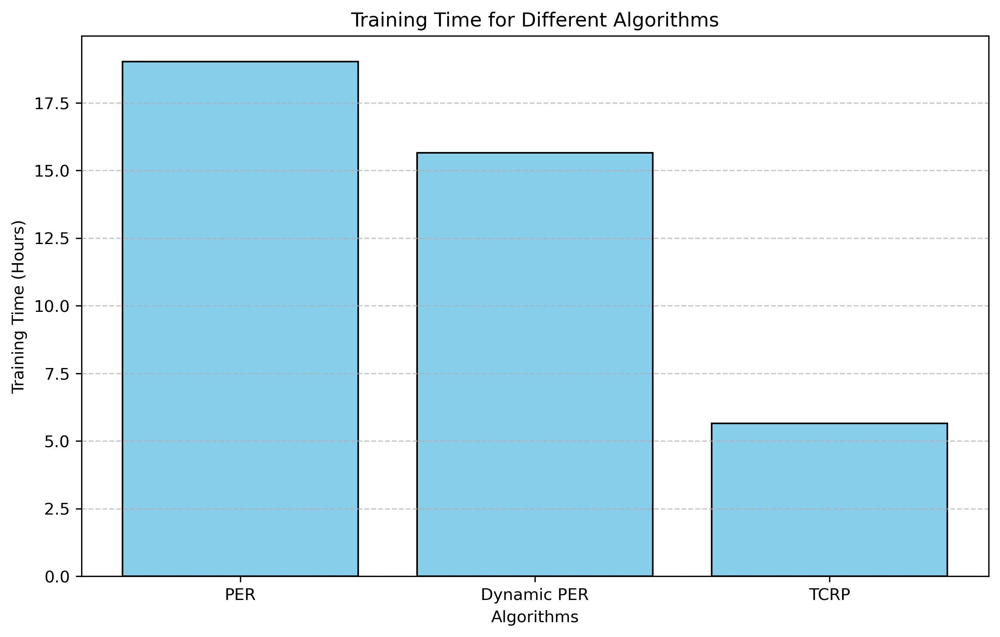

# TCRP: A Novel Heuristic for Experience Prioritization in Reinforcement Learning

## Overview

Transition Complexity and Reward Priority (TCRP) is an innovative reinforcement learning algorithm that optimizes experience replay by combining **transition complexity** and **reward magnitude** into a unified prioritization metric. This approach improves learning efficiency, convergence speed, and policy robustness, making it a significant advancement in reinforcement learning techniques.

## Features
- **Dynamic Experience Prioritization**: Combines transition complexity and reward magnitude for better replay efficiency.
- **Multi-Environment Support**: Works with CartPole, LunarLander, BipedalWalker, and CarRacing environments.
- **Deep Reinforcement Learning Integration**: Implements Double Deep Q-Networks (DDQN) for better performance.

## Repository Structure
This repository contains the following files and directories:

- `huber_loss.py` - Custom Huber loss function for robust optimization.
- `sumTree.py` - SumTree structure for prioritized replay buffer.
- `main.py` - Main script to run the TCRP algorithm.
- `dqn_cartpole.ipynb` - Jupyter notebook for the CartPole environment.
- `dqn_lunar.ipynb` - Jupyter notebook for the LunarLander environment.
- `dqn_carRacing.ipynb` - Jupyter notebook for the CarRacing environment.
- `dqn_Bipedal.ipynb` - Jupyter notebook for the BipedalWalker environment.
- `cartPole_best_model.h5` - Trained model for CartPole.
- `logs/` - Directory for TensorBoard logs to monitor training.
- `saved_models/` - Directory for storing saved model files.


## Getting Started

### Installation
1. Clone the repository:
   ```bash
   git clone https://github.com/nehlinshanila/TCRP-A-Novel-Heuristic-for-Experience-Prioritization-in-Reinforcement-Learning.git
   cd TCRP-A-Novel-Heuristic-for-Experience-Prioritization-in-Reinforcement-Learning
   cd adaptive behaviour algo
1. Install the required dependencies:
   ```bash
    pip install -r requirements.txt

## Environments

- CartPole
- LunarLander
- BipedalWalker
- CarRacing
<p align="center">
 
</p>


<h2>Experimental Setup</h2>
<p>The following table outlines the key configurations used:</p>

<table border="1">
  <tr>
    <th>Configuration</th>
    <th>Value</th>
  </tr>
  <tr>
    <td>Learning Rate</td>
    <td>0.001</td>
  </tr>
  <tr>
    <td>Discount Factor</td>
    <td>0.95</td>
  </tr>
  <tr>
    <td>Replay Buffer Size</td>
    <td>100,000</td>
  </tr>
  <tr>
    <td>Batch Size</td>
    <td>32</td>
  </tr>
  <tr>
    <td>Transition Complexity Coefficient</td>
    <td>0.00001</td>
  </tr>
  <tr>
    <td>Exploration Rate</td>
    <td>0.995</td>
  </tr>
  <tr>
    <td>Reward Prioritization Exponent</td>
    <td>0.8</td>
  </tr>
  <tr>
    <td>Total Episodes</td>
    <td>2000</td>
  </tr>
  <tr>
    <td>Timesteps per Episode</td>
    <td>500</td>
  </tr>
</table>


<body>
    <h1>Transition Complexity:</h1>
    <div class="formula math">
        <p><strong>Transition Complexity</strong> = √Σ<sub>i=1</sub><sup>n</sup> (S<sub>1,i</sub> - S<sub>2,i</sub>)<sup>2</sup></p>
        <p><strong>priority</strong> = (Complexity + ε) &middot; (reward + ε)<sup>α</sup></p>
    </div>
    <div>
        <ul>
            <li>S<sub>1</sub> = Current State, S<sub>2</sub> = Next State</li>
            <li>ε = Small value to avoid Zero, </li>
            <li>ε = α = Learning Rate </li>
        </ul>
    </div>
</body>
</html>

<p align="center">
   
</p>


<h2>TCRP Performance Highlights</h2>
<ul>
    <li><strong>Training Time Efficiency:</strong> TCRP significantly outperforms DPER and PER in training efficiency, achieving statistical significance with <em>p &lt; 0.01</em>, enabling quicker achievement of performance levels with fewer computational resources.</li>
    <li><strong>Higher Average Rewards:</strong> Demonstrates significant improvement in average rewards over DPER and PER, with a statistical significance of <em>p &lt; 0.05</em>, showing that TCRP not only learns faster but secures better long-term reward outcomes.</li>
    <li><strong>Faster Training Convergence:</strong> TCRP requires fewer episodes to reach optimal performance levels, indicating a faster convergence speed, highlighting its efficiency in leveraging high-priority transitions for quicker learning progress.</li>
    <li><strong>Robust Across Metrics:</strong> TCRP shows consistent superiority in training efficiency, reward gains, and convergence speed, emphasizing its robustness and effectiveness.</li>
    <li><strong>Effective in Dynamic Environments:</strong> Particularly potent in environments with dynamic state transitions, surpassing traditional methods in identifying and leveraging meaningful experiences.</li>
    <li><strong>Scalability:</strong> Maintains performance advantages without significant computational overhead as buffer capacities and dataset sizes increase.</li>
</ul>


  
## License
This project is licensed under the MIT License.
